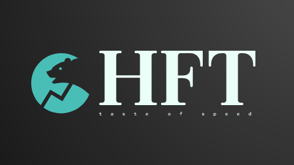

[![LinkedIn][linkedin-shield]][linkedin-url]

[linkedin-shield]: https://img.shields.io/badge/-LinkedIn-black.svg?style=for-the-badge&logo=linkedin&colorB=555
[linkedin-url]: https://linkedin.com/in/sadehghan

<!-- PROJECT LOGO -->
 

  

<!-- TABLE OF CONTENTS -->

  
Table of Contents

  <ol>
    <li>
      <a href="#about-the-project">About The Project</a>
    </li>
    <li>
      <a href="#getting-started">Getting Started</a>
      <ul>
        <li><a href="#prerequisites">Prerequisites</a></li>
        <li><a href="#installation">Installation</a></li>
      </ul>
    </li>
    <li><a href="#usage">Usage</a></li>
    <li><a href="#roadmap">Roadmap</a></li>
    <li><a href="#contributing">Contributing</a></li>
    <li><a href="#license">License</a></li>
    <li><a href="#contact">Contact</a></li>
    <li><a href="#acknowledgments">Acknowledgments</a></li>
  </ol>

<!-- ABOUT THE PROJECT -->
## About The Project

Taste of high frequency trading
Here's why:
* H
* F
* T

(<a href="#readme-top">back to top</a>)

## Build
### Linux
cmake --preset={unix-release/unix-dev}
cmake --build {Release/Debug}
### Windows
cmake --preset={windows-release-x64/windows-dev-x64}
cd {Release/Debug}
msbuild.exe HFT.sln /p:Configuration={Release/Debug} /p:Platform=x64
