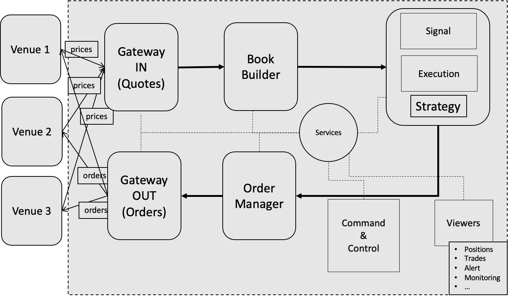

<a name="readme-top"></a>
# Taste of HFT
[![LinkedIn][linkedin-shield]][linkedin-url]


## Table of Contents <a name="content-list"></a>
- [About The Project](#about)
     - [What is HFT ?](#what)
     - [Why HFT ?](#why)
     - [What are HFT strategies?](#strategies)
- [Architecture](#arch)
- [Build](#build)
     - [Prerequisites](#pre)
     - [Linux](#linux)
     - [Windows](#windows)
- [License](#license)

[linkedin-shield]: https://img.shields.io/badge/-LinkedIn-black.svg?style=for-the-badge&logo=linkedin&colorB=555
[linkedin-url]: https://linkedin.com/in/sadehghan

<!-- ABOUT THE PROJECT -->
## About The Project <a name="about"></a>
The goal of this project is to build a trading system from scratch by using the most advanced technical choices for optimizing speed and scalability.

### What is HFT ? <a name="what"></a>
High-Frequency Trading (HFT) is a form of automated trading. For the last twenty years, HFT has gained recognition in the media and in society.

### Why HFT ? <a name="why"></a>
HFT aims at getting many transactions per second. In this way, companies can react more quickly to a changing market.
They can take advantage of more opportunities than they would have without this speed.
HFT trading should have the shortest feasible data latency (time delays) and the highest level of automation possible.
HFT relates to algorithmic trading and automated trading.
As a result, participants choose to trade in markets that have a high level of automation and integration in their trading platforms.

### What are HFT strategies? <a name="strategies"></a>
HFT strategies can be applied to any asset classes, such as stocks, futures, bonds, options, and FX.
We also have cryptocurrencies being traded using HFT strategies, even if the definition of speed is different
* Liquidity
* Tick-by-tick data and data distribution
* Liquidity rebates
* Matching engine
* Market making
* Scalping
* Statistical arbitrage
* Latency arbitrage
* Momentum ignition
* Rebate strategies

<p align="right">(<a href="#content-list">back to top</a>)</p>

## Architecture <a name="arch"></a>


<p align="right">(<a href="#content-list">back to top</a>)</p>

## Build <a name="build"></a>
### Prerequisites <a name="pre"></a>
```
sudo apt-get install python3
pip3 install conan
```
### Linux <a name="linux"></a>
```
cmake --preset={unix-release/unix-dev}
cmake --build {Release/Debug}
```
### Windows <a name="windows"></a>
```
cmake --preset={windows-release-x64/windows-dev-x64}
cd {Release/Debug}
msbuild.exe HFT.sln /p:Configuration={Release/Debug} /p:Platform=x64
```
<p align="right">(<a href="#readme-top">back to top</a>)</p>
